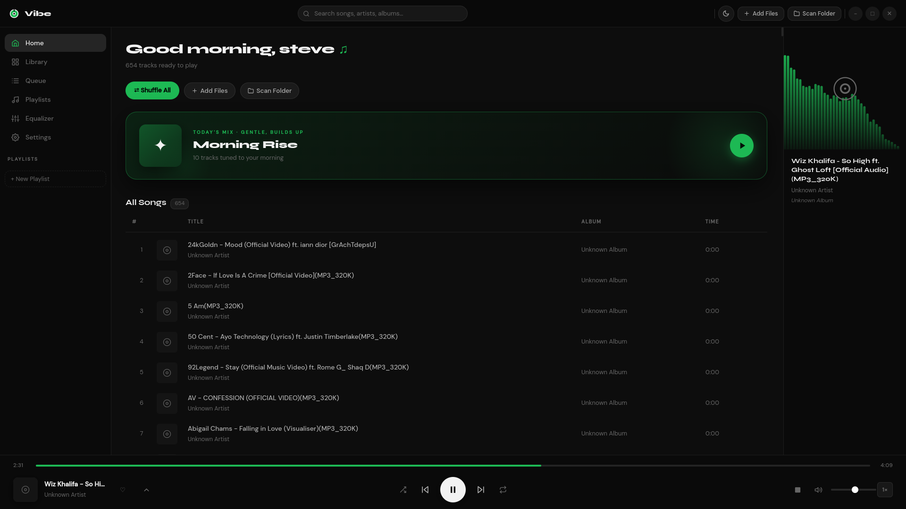
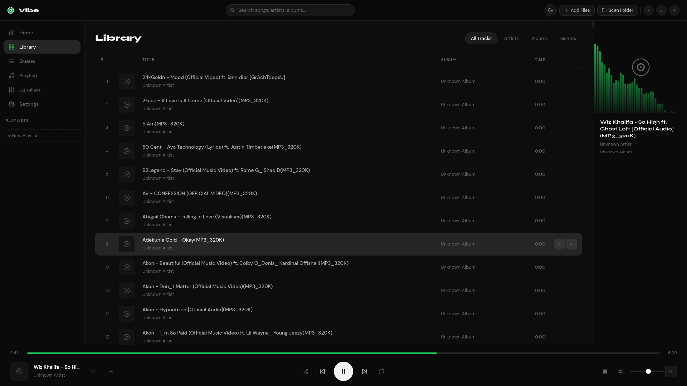
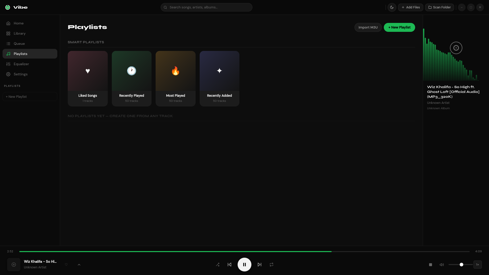
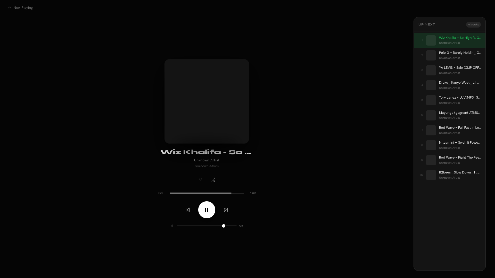
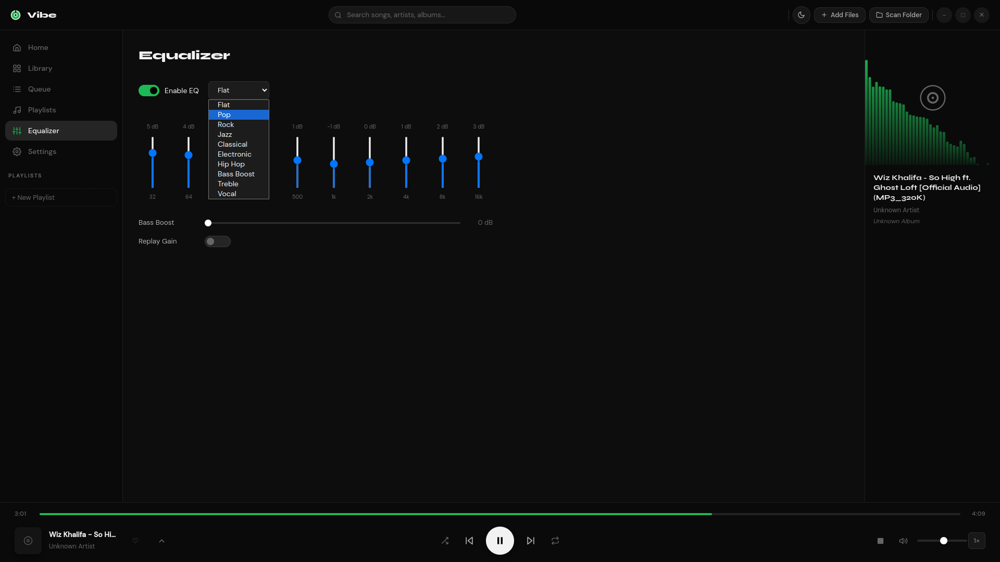
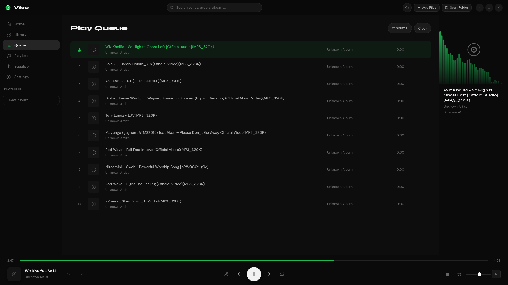
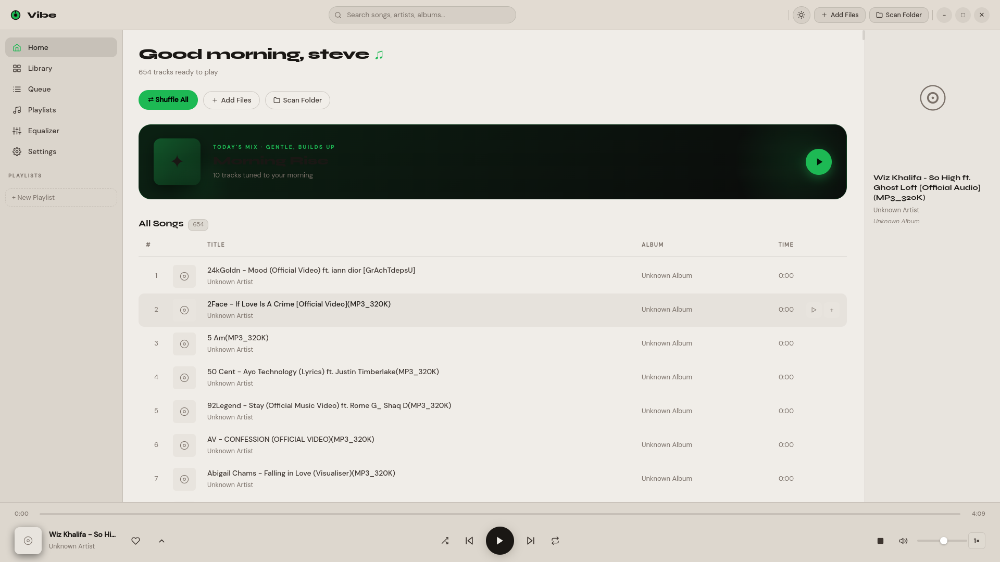
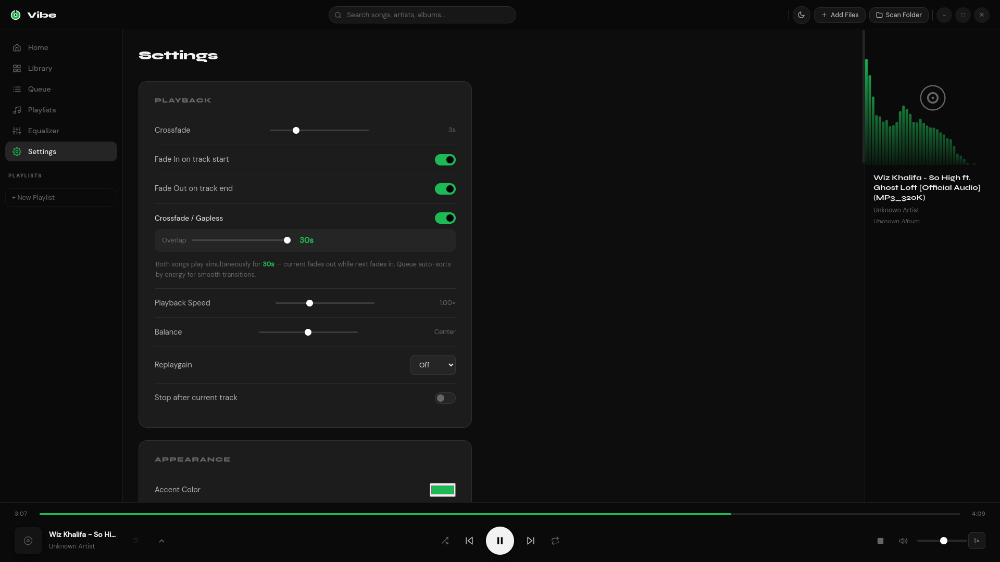

<div align="center">

<br/>


<br/><br/>

# ◉ Vibe

### A music player that feels right.

_Gapless crossfade · Smart daily mix · Clean dark UI · No streaming · Your music, your way._

<br/>

</div>

---

## ✦ Features

**Gapless Crossfade**
Songs blend into each other seamlessly. Configurable overlap window — no silence, no hard cuts. The crossfade engine runs dual audio elements with Web Audio API gain ramping so both tracks play simultaneously during the transition.

**Today's Mix**
A smart daily playlist that adapts to the time of day. Morning gets a gentle build-up, midday peaks high, evening waves, night winds down. The algorithm scores every track using bitrate, duration, genre keywords, title signals, play history, and liked status — then orders them into an energy arc.

**Smart Playlists**
Four auto-generated playlists that stay fresh automatically:

- ♥ **Liked Songs** — everything you've hearted
- ◷ **Recently Played** — your listening history
- ↑ **Most Played** — your all-time favourites
- ✦ **Recently Added** — newest tracks in your library

**Now Playing Screen**
Full-screen overlay with blurred album art backdrop, animated breathing album art, seek bar with scrubbing thumb, transport controls, volume slider, and an Up Next queue panel.

**Smart Queue**
The queue reflects exactly what you played — play from Most Played and only those tracks queue up. Play from a playlist and only that playlist queues. No surprise all-library dumps.

**Visualizer**
Four modes: Bars · Wave · Circle · Particles. Synced to the Web Audio API analyser in real time.

**Equalizer**
10-band EQ with presets: Flat, Bass Boost, Vocal Clarity, Electronic, Classical, and more.

**Delete from Disk**
Right-click any track → Delete from Disk moves it to the OS trash (recoverable).

---

## ⬇ Installation

### Linux (Debian / Ubuntu)

```bash
sudo dpkg -i vibe_1.0.6_amd64.deb
```

### Windows

coming soon

### Build from Source

```bash
git clone https://github.com/Steve7cf/vibe.git
cd vibe
npm install
npm start
```

**Requirements:** Node.js 18+ · Electron 28+

---

## 🎵 Supported Formats

| Format     | Extension      |
| ---------- | -------------- |
| MP3        | `.mp3`         |
| FLAC       | `.flac`        |
| WAV        | `.wav`         |
| OGG Vorbis | `.ogg`         |
| AAC / M4A  | `.m4a`, `.aac` |
| OPUS       | `.opus`        |
| WMA        | `.wma`         |

---

## 🖥 Screenshots

<p align="center">
  <a href="images/home.png"></a>
  <a href="images/library.png"></a>
  <a href="images/playlist.png"></a>
</p>

<p align="center">
  <a href="images/now_playing.png"></a>
  <a href="images/equalizer.png"></a>
  <a href="images/queue.png"></a>
</p>

<p align="center">
  <a href="images/light.png"></a>
  <a href="images/settings.png"></a>
</p>

---

## 🏗 Tech Stack

| Layer        | Technology                                             |
| ------------ | ------------------------------------------------------ |
| Shell        | Electron 28                                            |
| Audio engine | Web Audio API — dual AudioElement + GainNode crossfade |
| Metadata     | music-metadata + Audio element duration probe fallback |
| UI           | Vanilla JS + CSS custom properties — zero framework    |
| Storage      | electron-store (JSON persistence)                      |
| Build        | electron-builder                                       |

---

## 📁 Project Structure

```
vibe/
├── src/
│   ├── main/
│   │   ├── main.js          # Electron main process
│   │   └── preload.js       # IPC bridge
│   └── renderer/
│       ├── index.html       # App shell
│       ├── js/
│       │   ├── app.js       # Config, init, Today Mix scheduling
│       │   ├── player.js    # Playback, queue, crossfade
│       │   ├── audio.js     # Web Audio engine, EQ, visualizer
│       │   ├── library.js   # Track store, smart playlists, scoring
│       │   └── ui.js        # All rendering and event binding
│       └── css/
│           └── main.css     # Full design system
├── package.json
└── README.md
```

---

## 🚀 Build for Release

```bash
# Linux .deb
npx electron-builder --linux deb

# Windows .exe
npx electron-builder --windows nsis


See `.github/workflows/build.yml` for the automated CI/CD pipeline.

---


## 📄 License

MIT — do what you want, keep the credit.

---

<div align="center">

Made with care by **Steve Bazaar**

[stevebazaar99@gmail.com](mailto:stevebazaar99@gmail.com)

<br/>

_If Vibe hits different, leave a ⭐_

</div>
